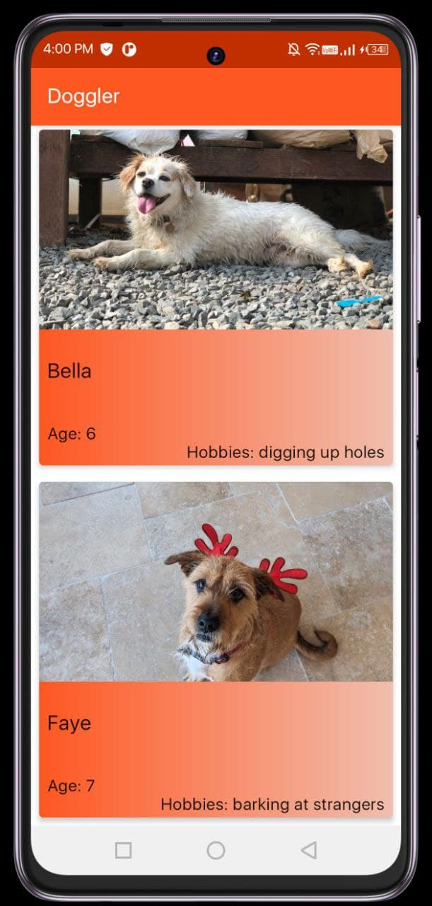
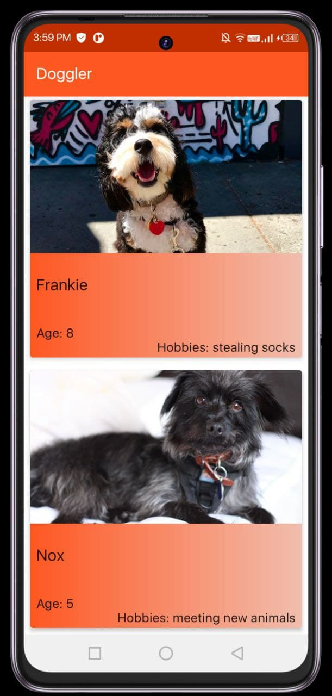
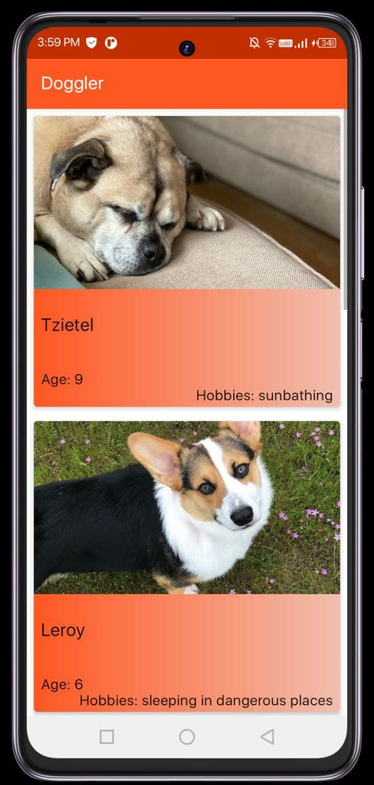
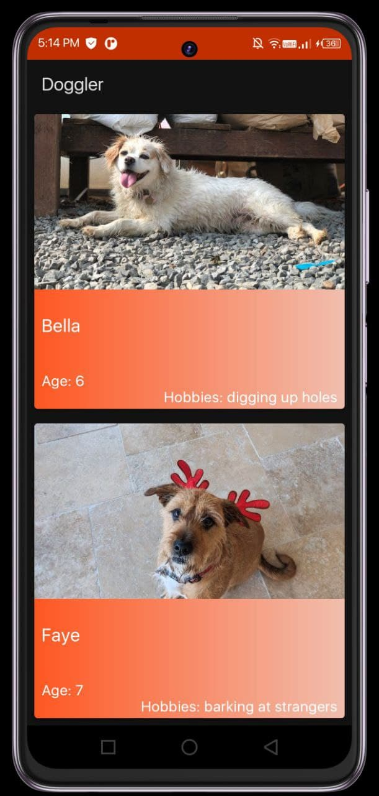
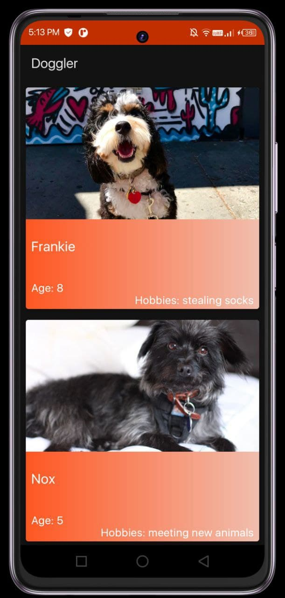
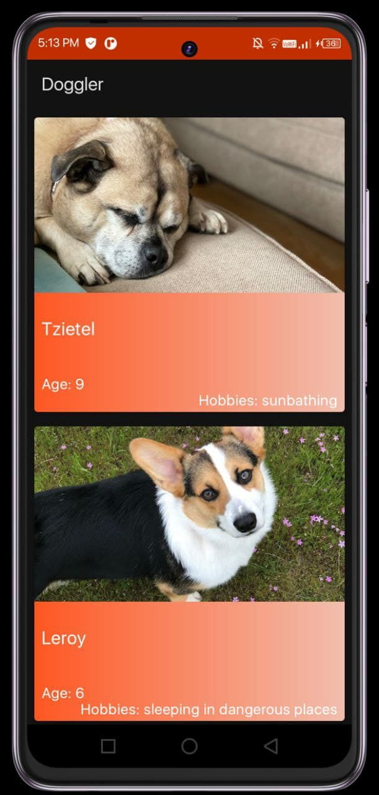

# Recycler View Implementation App

### Dark Mode

## Explanation of working of Recycler View

Now taking the example of this app, suppose we want to create an app which shows a list of Data about Dogs.Now there are two solutions that we can choose from:-
* ListView
* Recycler View
We should not use ListView because it has some optimization problems.
 
 
ListView basically loads all the data into the ram ,  which makes the performance of the app very laggy.
On the other hand Recycler View loads only that much part of data that is needed to fill up the screen at a time.
Which greatly increases the performance.

### Working

Now suppose we want to make an app which shows data about Dogs.

Here first of all we have to collect some resources which we will store in Strings.xml or Drawable.

After we need to create a data class to store all the data.(Dog.kt)

Now after that we need to make a DataSource (Datasource.kt) we provides the data to the adapter. Do not confuse it with Dog.kt, it is just storing data , it is not a source of data.

We also need to create a layout file for what we want to show in Recycler View(list_item.xml) 

Now we will build the adapter for Recycler View (ItemAdapter.kt).It basically contains some functions which perform:-
* getItemCount() -> return size of dataset
* onCreateViewHolder() -> It provides views to show if screen is scrolled.
* onBindViewHolder() -> It supplies data for the views.
 