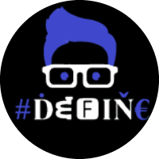

<h1 align="center">	&#127875;<b><i>It's October, time for HacktoberFest</i></b>	&#127875; </h1>
<p align="center">
  <a></a>
</p>

# :gift: Hacktoberfest 2021

#### :dart: Let's celebrate [Hacktoberfest](https://hacktoberfest.digitalocean.com/) by getting involved in the open source community and start your journey in open source.

#### :dart: This repository is open to all the members of the GitHub community. Feel free to contribute to this repository.

<br>
<p align="center">
  </a>
</p>
<br>

## :label: What is Hacktoberfest ? :computer:

➡️ Hacktoberfest is a month-long celebration of open source software run by DigitalOcean.

➡️ During the month of October, they invite you to join open-source software enthusiasts, beginners, and the developer community by contributing to open-source projects.

➡️ So, make your contributions to make this Hacktoberfest a success, with a chance to receive cool swags and give yourself a headstart in your open source journey.
<br>

## :label: Participation Rules 📝

➡️ Pull requests can be made to any public repository on GitHub, look for the "hacktoberfest" topic to know whether the project is participating or not. The pull request must contain commits you made yourself.

➡️ If a maintainer reports your pull request as 🔴<b> spam </b>, it will not be counted towards your participation in Hacktoberfest.

➡️ If a maintainer reports behavior that’s not in line with the project’s code of conduct, you will be ineligible to participate.
<br>

## :label: Rules Regarding Submission of PR :bookmark:

➡️ Participant can contribute anything he wishes for.

➡️ Make sure to pull request in the respective folder.

➡️ Your <b>PR</b> must be valid.

➡️ Don't just copy and paste code from other website/blogs .

➡️ Submitting someone else work will be reported as 🔴spam.

<br>

## :popcorn: Technologies in which you can contribute:

  <p align='center'>
  
| *MobileDev* | *CyberSec* | *DSA* | *ML-AI* | *WebDev* |
| --- | --- | --- | --- | --- | 
  
  <br>
 
## :label: Getting Started

- First, fork the repository (Click the <b><b>Fork</b></b> button in the top right corner of the page).
- Clone the forked repository to your local machine.

```markdown
git clone https://github.com/your-username/hacktoberfest.git
```

- Add upstream URL

```markdown
git remote add upstream https://github.com/hash-define-organization/Hacktober-Fest-2021.git
```

- Create a new branch

```markdown
git checkout -b branch_name
```

- Make your contribution
- Commit and push the changes

```markdown
git add .
git commit -m 'Relevant message'
git push origin branch_name
```

- Create a new pull request from your forked repository (Click the `New Pull Request` button located at the top of your repo)
- Wait for your PR review and approval from the maintainers.
- :star: this repository if you liked it.
- Check your progress here (https://hacktoberfest.digitalocean.com/profile)
  <br>

## 📜 Our Standards

:arrow_forward: Using welcoming language.

:arrow_forward: Being respectful to others viewpoints.

:arrow_forward: Accepting constructive criticism.

:arrow_forward: Heavily focusing on what is best for the community
<br>

## :label: About #DEFINE :trophy:

:point_right: We at #define aim to build a platform that will not only encourage you to find which domain interests you but will also help you to come forward and gain expertise in that.

:point_right: #define has also started a New Developer Circle in different colleges and college students in term of coding, development any many more.

 <p> 
   <br>
   
## Connect with us on:
 <br>
 <a href="https://discord.gg/tTs553YWyb">
    
  </a>&ensp;
   
  <a href="https://in.linkedin.com/in/hashdefine?trk=people-guest_people_search-card">
    
  </a>&ensp;
  
  <a href="https://www.instagram.com/hash_define/">
    
   </a>&ensp;
 
  <a href="https://www.youtube.com/channel/UCDqf3_N1l7s0dVAVycN8FQA">
    
   </a>&ensp;

   <a href="mailto:hashdefinebpit@gmail.com">
    
   </a>&ensp;
</p>

<br>

## :game_die: Shoutout to all the contributors ❤️

<a href="https://github.com/hash-define-organization/Hacktober-Fest-2021/graphs/contributors">
  
</a>
