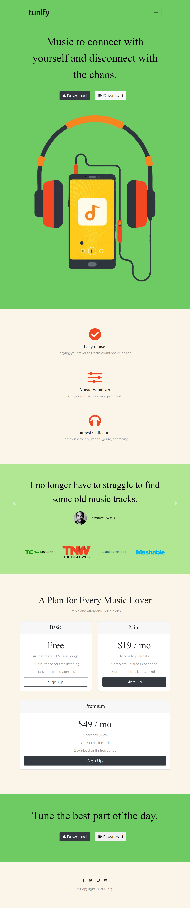
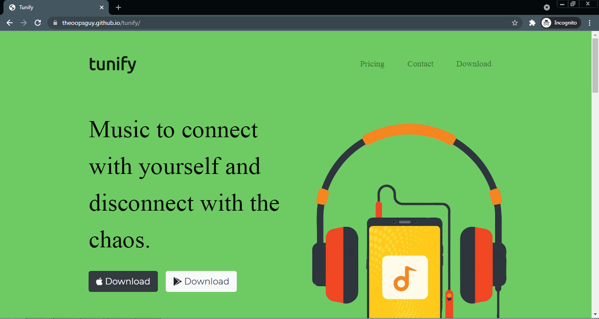
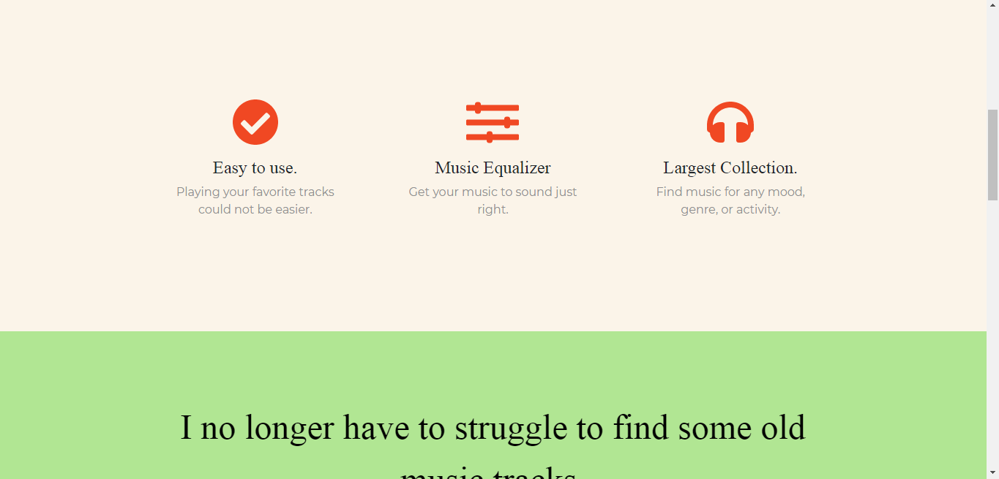
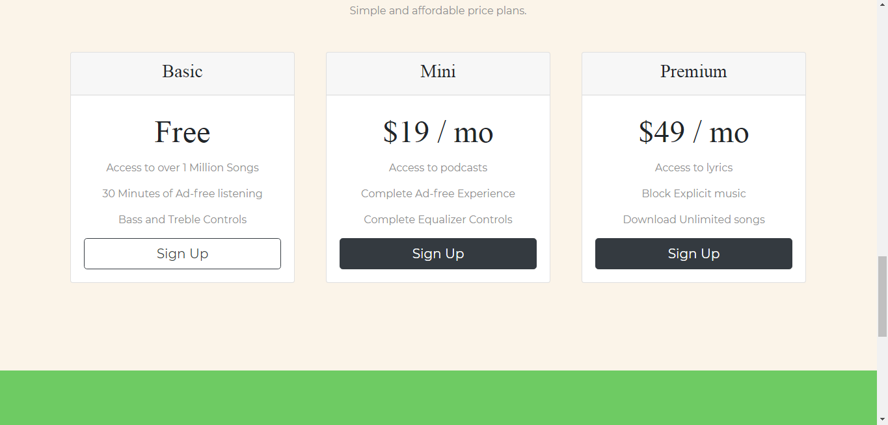
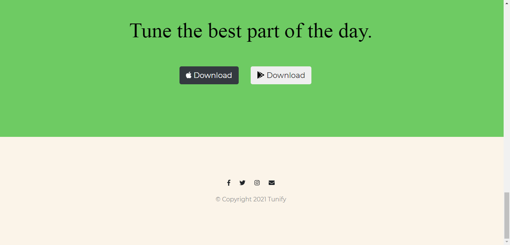

# Tunify

A responsive web page for Tunify - a music streaming app.

- Responsive - Mobile optimized.
- Uses Bootstrap framework.
- Built using pure HTML and CSS.
- Minimalist design.

&emsp;

You can have a look at my website [here.](https://theoopsguy.github.io/tunify/ "Tunify")

&emsp;

---

&emsp;

Here is how it looks on a mobile screen:

&emsp;

---

&emsp;

Here is how it looks on a computer screen:

